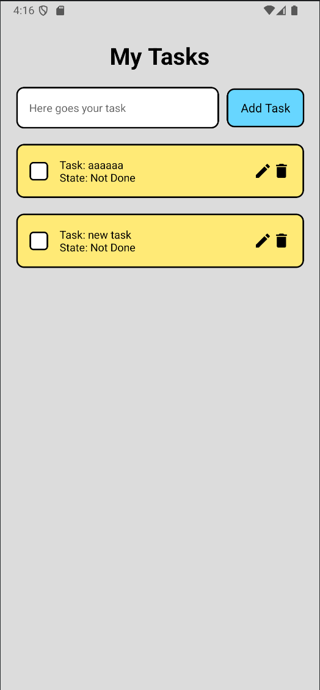
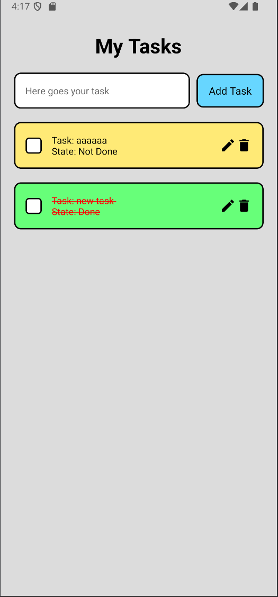
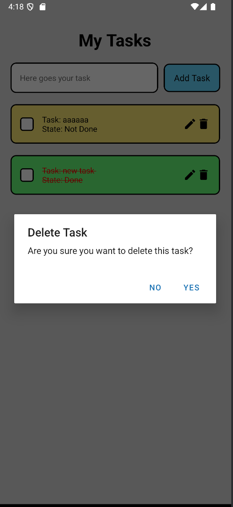
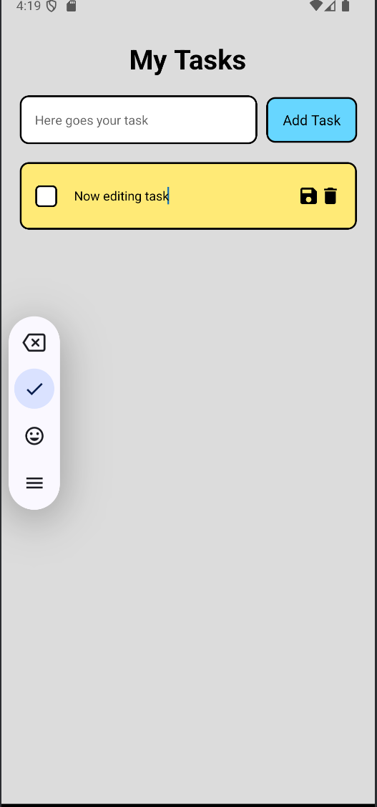
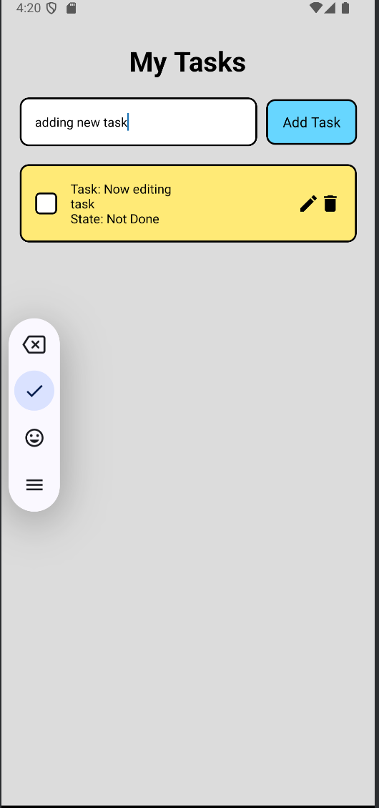

# React Task Management App

This is a simple task management app built with React Native. The app allows users to add, edit, complete, and delete tasks. Completed tasks are visually distinguished by a different background color, red text color, and a strikethrough line.

## Features

- Add new tasks
- Edit existing tasks
- Mark tasks as completed
- Delete tasks
- Visual distinction for completed tasks

## Usage

- To add a new task, type the task description in the input field and press the "Add Task" button.
- To edit a task, click the edit icon next to the task, modify the text, and press the save icon.
- To mark a task as completed, click the square icon next to the task.
- To delete a task, click the delete icon next to the task.

## Screenshots







## Installation

1. Clone the repository:

```bash
git clone https://github.com/yourusername/react-task.git
cd ToDoApp
```

2. Install dependencies:

```bash
pnpm install
```

3. Start the development server (for android):

```bash
pnpm run android
```

4. Start the development server (for web):

```bash
pnpm run web

```

5. Start the development server (for iOS):

```bash
pnpm run ios
```
